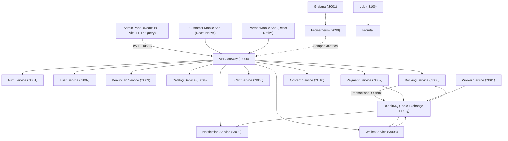

# 01 — Admin System & Architecture Audit

## Executive Summary
The **GetReady** platform is architected as an asynchronous, event-driven microservices ecosystem running behind an API Gateway (`:3000` / `:8080`). This audit evaluates the backend microservices, database models, event topologies, RBAC structures, and the current Admin Panel frontend to establish a roadmap for transforming the Admin Dashboard into an enterprise-grade **Control Center**.

---

## 1. Ecosystem Topology

---

## 2. Microservice & Data Ownership Audit

| Service | Port | Database / Collections | Key Responsibilities |
|---|---|---|---|
| **API Gateway** | 3000 / 8080 | Stateless (Redis for rate limits) | Reverse proxy, Correlation ID, Auth token verification, RBAC header enrichment, Swagger docs |
| **Auth Service** | 3001 | `users`, `refresh_tokens` | Admin & Client auth, OTP issuance, JWT token signing, Password hashing |
| **User Service** | 3002 | `users`, `addresses`, `members`, `customer_profiles`, `roles`, `permissions` | Account owners, Customer Profiles (Self, Mother, Sister), Beauty Passport, RBAC Definitions |
| **Beautician Service** | 3003 | `beautician_profiles`, `bank_details`, `skills` | Beautician onboarding, KYC approval, Skills matrix, Real-time availability & leave calendar |
| **Catalog Service** | 3004 | `services`, `categories`, `packages`, `hygiene_kits`, `service_change_requests` | Service catalog, Upgrade candidate pairs, Mandatory Hygiene Kit metadata, Package bundles |
| **Booking Service** | 3005 | `bookings`, `slots`, `booking_settings`, `booking_outboxes`, `idempotency_records` | Multi-Customer / Multi-Beautician orchestration, Slot locking, Start/End OTP, Pricing snapshots, Cancellation Engine |
| **Cart Service** | 3006 | `carts` | Client cart staging, temporary pricing estimates |
| **Payment Service** | 3007 | `payments`, `payment_orders` | Razorpay order creation, Webhook verification, Refund processing |
| **Wallet Service** | 3008 | `wallets`, `wallet_transactions`, `loyalty_rules` | Customer wallet balance, Ledger adjustments, Cashback & Points credit upon booking completion |
| **Notification Service**| 3009 | `notifications`, `notification_templates` | Push, SMS, Email, In-app messaging, Template variable replacement |
| **Content Service** | 3010 | `banners`, `blogs`, `cms_pages` | App/Web banners, Blog articles, Dynamic CMS policies (FAQ, Terms, Privacy) |
| **Worker Service** | 3011 | Stateless | Outbox publisher, Cron slot scheduler, DLQ re-delivery |

---

## 3. Frontend Architecture Audit (`/Admin`)

- **Build Stack**: Vite 8, React 19, TailwindCSS 4, Radix UI Primitives, Lucide Icons, Recharts, Redux Toolkit Query (`api.injectEndpoints`).
- **Design System**: High visual aesthetics (zinc dark mode, emerald/indigo accents, glassmorphic cards).
- **Current Limitation**: Multiple screens rely on local mock datasets (`data.js` or static array fallbacks).
- **Transition Goal**: Replace mock data with live RTK Query hooks connected to API Gateway endpoints, add robust filtering, pagination, server-side search, audit logging, and actionable drawer/modal forms.
