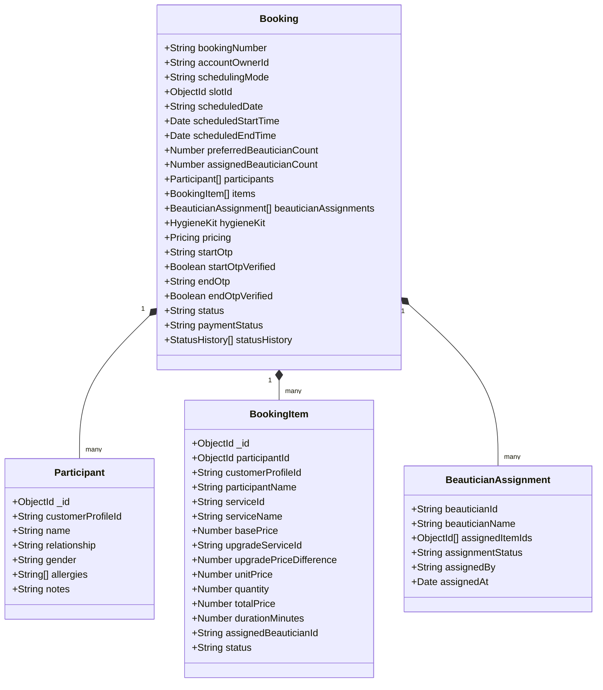

# 05 — Admin Data Models & Aggregation Schemas

## 1. Multi-Customer Booking Schema (`booking-service`)



---

## 2. Admin Analytics Aggregation Contracts

### A. Executive Dashboard Summary (`/api/v1/bookings/analytics/dashboard`)
```json
{
  "kpis": {
    "grossRevenue": 348500,
    "revenueChange": 14.2,
    "totalBookings": 482,
    "bookingsChange": 8.5,
    "activeCustomers": 1284,
    "activeBeauticians": 42,
    "pendingAssignments": 3,
    "completedRate": 96.4,
    "averageOrderValue": 1850
  },
  "charts": {
    "revenueTrend": [
      { "date": "2026-09-01", "revenue": 45000, "bookings": 32 },
      { "date": "2026-09-02", "revenue": 52000, "bookings": 38 }
    ],
    "categoryBreakdown": [
      { "name": "Facials & Skincare", "value": 38 },
      { "name": "Hair Services", "value": 32 },
      { "name": "Waxing & Threading", "value": 18 },
      { "name": "Spa & Massage", "value": 12 }
    ]
  }
}
```

---

## 3. Real-Time Operations Snapshot (`/api/v1/bookings/operations/live`)
```json
{
  "systemStatus": "OPTIMAL",
  "queues": {
    "pendingAssignment": 3,
    "arriving": 5,
    "inProgress": 12,
    "completedToday": 84
  },
  "beauticians": {
    "online": 38,
    "busy": 12,
    "available": 26,
    "onLeave": 4
  },
  "infraHealth": {
    "apiGateway": "UP",
    "rabbitMQ": "UP",
    "mongoDb": "UP",
    "redis": "UP"
  }
}
```
