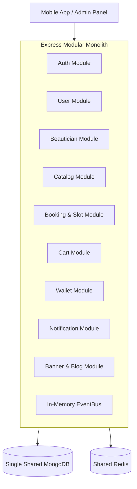

# 01 - Current Architecture Audit (Modular Monolith)

## Overview
The legacy GetReady backend was structured as a modular monolith in Express.js. Although domain logic was partitioned into module folders (`src/modules/*`), all components ran in a single OS process sharing a single MongoDB instance and shared memory event emitter.

## Discovered Deficiencies in Legacy Architecture
1. **Shared Database & Process Contention**: High CPU or memory usage during catalog searches or booking bursts degraded authentication and payment webhooks.
2. **Synchronous In-Memory Events**: In-memory event emitters (`EventBus.js`) caused message loss during server restarts or crashes.
3. **No Transactional Outbox**: Database state could commit while notifications or external events failed silently.
4. **Coupled Deployments**: Any bug in blog or banner modules required a full backend redeployment.
5. **No Independent Scalability**: High slot-selection concurrency could not be scaled independently of static content endpoints.
