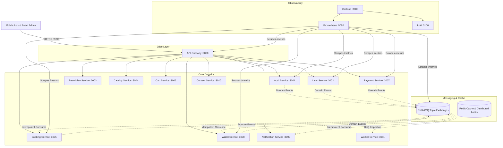

# 02 - Target Microservices Architecture

## Overview
The target architecture is a production-grade distributed system based on Domain-Driven Design (DDD), Database-per-Service isolation, RabbitMQ event-driven choreography, and an API Gateway fronting all client requests.

