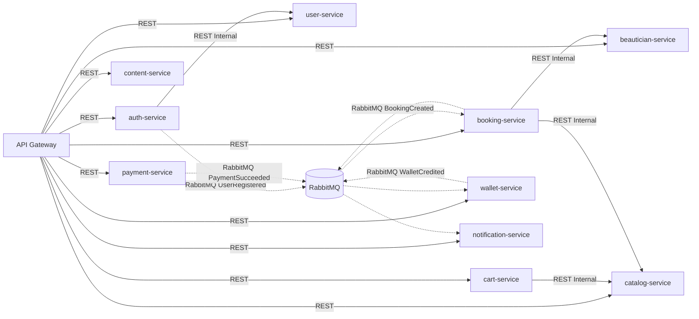

# 04 - Service Dependencies & Inter-Service Communication

## Communication Matrix

## Synchronous REST Dependencies
1. **auth-service -> user-service**: To create or lookup user records during login, registration, and OTP verification.
2. **cart-service -> catalog-service**: To validate service items, combo packages, and fetch pricing snapshots.
3. **booking-service -> catalog-service & beautician-service**: To validate service durations and beautician availability.

## Asynchronous RabbitMQ Dependencies
1. **PaymentSucceeded -> booking-service & wallet-service**: Confirms booking or processes topup.
2. **BookingCreated / BookingConfirmed -> notification-service**: Dispatches customer and beautician notifications.
3. **BookingCancelled -> wallet-service**: Issues instant wallet refund.
