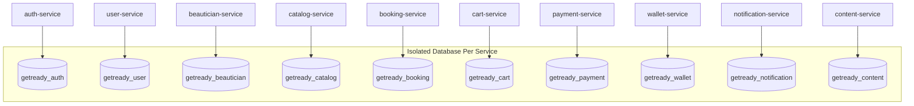

# 05 - Database Ownership per Service

Each microservice strictly owns its dedicated database (or database schema). Direct cross-service database access or foreign keys across service boundaries are completely prohibited.

| Service | Database Name | Collections Owned |
|---|---|---|
| `auth-service` | `getready_auth` | `refresh_tokens`, `otps` |
| `user-service` | `getready_user` | `users`, `addresses`, `members`, `roles`, `permissions` |
| `beautician-service` | `getready_beautician` | `beautician_profiles`, `bank_details`, `skills` |
| `catalog-service` | `getready_catalog` | `categories`, `services`, `service_change_requests`, `packages`, `filters`, `hygiene_kits` |
| `booking-service` | `getready_booking` | `bookings`, `outbox_events`, `idempotencies` |
| `cart-service` | `getready_cart` | `carts` |
| `payment-service` | `getready_payment` | `payments`, `idempotencies` |
| `wallet-service` | `getready_wallet` | `wallets`, `wallet_transactions`, `loyalty_rules`, `idempotencies` |
| `notification-service` | `getready_notification` | `notifications`, `idempotencies` |
| `content-service` | `getready_content` | `banners`, `blogs` |
