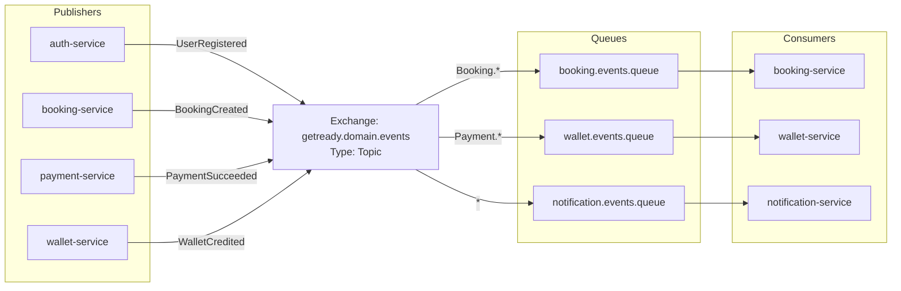

# 06 - RabbitMQ Messaging Architecture

## Overview
RabbitMQ is the messaging backbone of the GetReady distributed platform. All asynchronous domain event distribution and command pipelines are coordinated via RabbitMQ topic exchanges.

## Exchanges
1. `getready.domain.events` (Topic, Durable): Dispatches all domain life-cycle events.
2. `getready.commands` (Direct, Durable): Asynchronous command routing.
3. `getready.retry` (Topic, Durable): Exponential backoff retry queue routing.
4. `getready.dlx` (Fanout, Durable): Dead Letter Exchange for unrecoverable errors.
