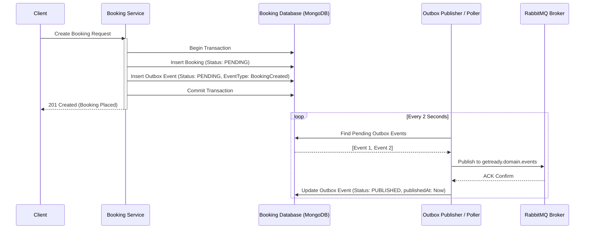

# 09 - Transactional Outbox Pattern

## Dual-Write Problem Prevention

In distributed systems, writing to a database and publishing to a message broker in separate steps risks inconsistency if one fails. The Transactional Outbox pattern guarantees that database state and domain events are committed atomically within a single local database transaction.



## Outbox Document Schema
```typescript
interface OutboxEvent {
  id: string;
  eventId: string;
  aggregateType: 'Booking' | 'Payment' | 'Wallet';
  aggregateId: string;
  eventType: string;
  eventVersion: number;
  payload: Record<string, any>;
  status: 'PENDING' | 'PUBLISHED' | 'FAILED';
  attempts: number;
  createdAt: Date;
  publishedAt?: Date;
  lastError?: string;
}
```
