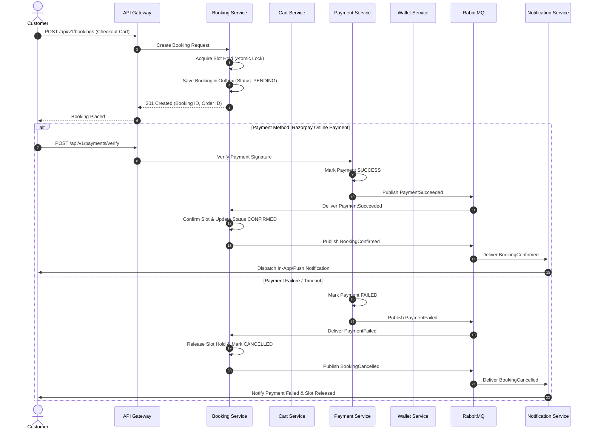

# 10 - Distributed Saga Workflows & Orchestration

GetReady avoids two-phase commit (2PC) in favor of Choreography and Orchestration Sagas with compensating transactions.

## Booking & Payment Saga Flow

