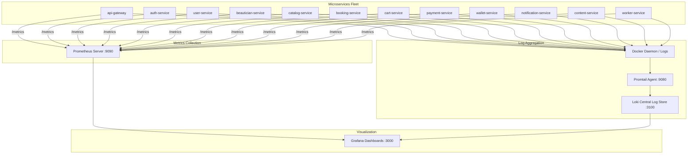

# 12 - Observability Stack (Prometheus, Grafana, Loki)

## Full Observability Pipeline

## Configured Dashboards
1. `GETREADY - SYSTEM OVERVIEW`: Global throughput, 4xx/5xx error rates, P95/P99 latency, and active connections.
2. `GETREADY - MICROSERVICES`: Per-service CPU/RAM utilization, request counters, and error distributions.
3. `GETREADY - RABBITMQ`: Published/consumed message rates, queue depths, retry executions, and DLQ tracking.
4. `GETREADY - DATABASE`: MongoDB query durations and active connection pools.
5. `GETREADY - BUSINESS`: Live booking creation, payment success/failure ratios, wallet transaction volume, and notification delivery stats.
