# 13 - Docker Deployment & Containerization

## Topology Overview

```mermaid
flowchart TD
    subgraph Host Environment
        subgraph Ports Exposed
            P_GW[8080 -> Gateway]
            P_GF[3000 -> Grafana]
            P_PM[9090 -> Prometheus]
            P_MQ[15672 -> RabbitMQ UI]
        end

        subgraph Docker Network: getready-network
            GW[getready-api-gateway]
            S_Auth[getready-auth-service]
            S_User[getready-user-service]
            S_Beaut[getready-beautician-service]
            S_Cat[getready-catalog-service]
            S_Book[getready-booking-service]
            S_Cart[getready-cart-service]
            S_Pay[getready-payment-service]
            S_Wall[getready-wallet-service]
            S_Notif[getready-notification-service]
            S_Cont[getready-content-service]
            S_Work[getready-worker-service]

            I_Mongo[(MongoDB Atlas Cloud Cluster)]
            I_Redis[(getready-redis :6379)]
            I_RMQ[(getready-rabbitmq :5672)]
            I_Prom[getready-prometheus]
            I_Graf[getready-grafana]
            I_Loki[getready-loki]
            I_Tail[getready-promtail]
        end
    end
```



## Running the Complete Fleet
```bash
# Build and start all services in detached mode
docker-compose up -d --build

# View real-time logs across all services
docker-compose logs -f

# Check health of all containers
docker-compose ps
```
