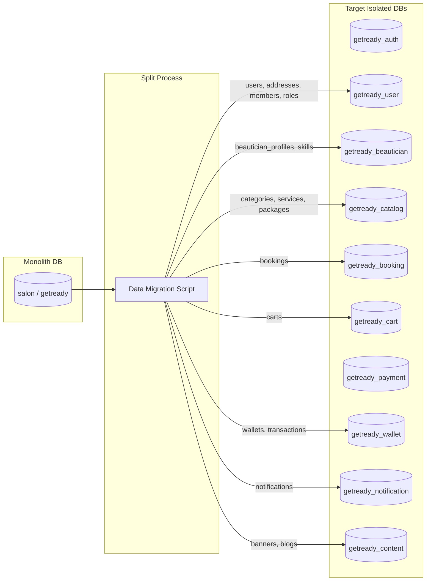

# 14 - Database Migration Strategy & Data Isolation

## Migration Strategy (Strangler Fig Pattern)

To achieve zero downtime and prevent data corruption, existing collections in the legacy monolith MongoDB database are migrated to their corresponding microservice databases using an incremental dual-read/dual-write or offline split script.

## Migration Validation Checklist
- Verify document counts between source and destination collections.
- Ensure all indexes and unique constraints (`email`, `phone`, `slug`, `orderId`) exist in target databases.
- Test read and write consistency before cutting over traffic from the API Gateway.
