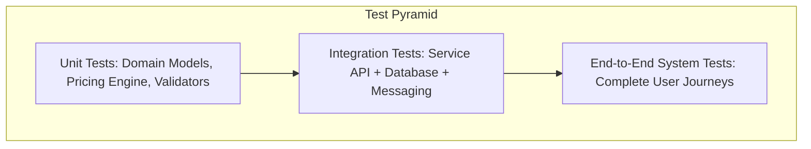

# 15 - Comprehensive Testing Strategy

## Multi-Layer Testing Architecture

## Critical Test Scenarios
1. **Authentication & Identity**: User OTP registration, JWT verification, refresh token rotation, and expired token rejection.
2. **Concurrent Slot Booking**: Verifying two users attempting to reserve the exact same slot time cannot result in double bookings.
3. **Payment Idempotency**: Duplicate payment webhook events do not create multiple wallet credits or corrupt booking confirmations.
4. **RabbitMQ Retry & DLQ**: Simulated consumer exceptions trigger exponential backoff before landing safely in `getready.dlq`.
5. **Observability Verification**: Scraping `/metrics` returns standard Prometheus counters, gauges, and histograms.
