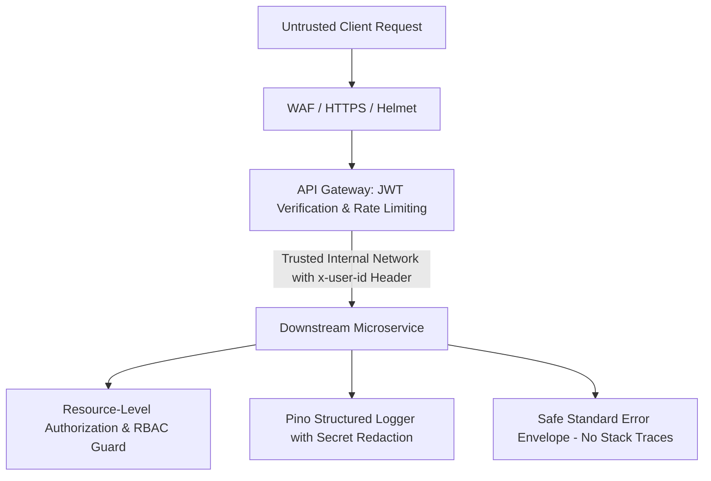

# 16 - Production Security Guidelines & Hardening

## Defense in Depth

## Security Best Practices Enforced
1. **Zero Secret Leakage**: Passwords, OTPs, JWT secrets, payment tokens, and database passwords are redacted from logs and error payloads.
2. **Network Isolation**: Microservices and databases are isolated within Docker bridge networks, only exposing API Gateway (`:8080`), Grafana (`:3000`), and Prometheus (`:9090`).
3. **Safe Error Formatting**: Internal database stack traces or SQL/Mongo details are never returned to end users.
