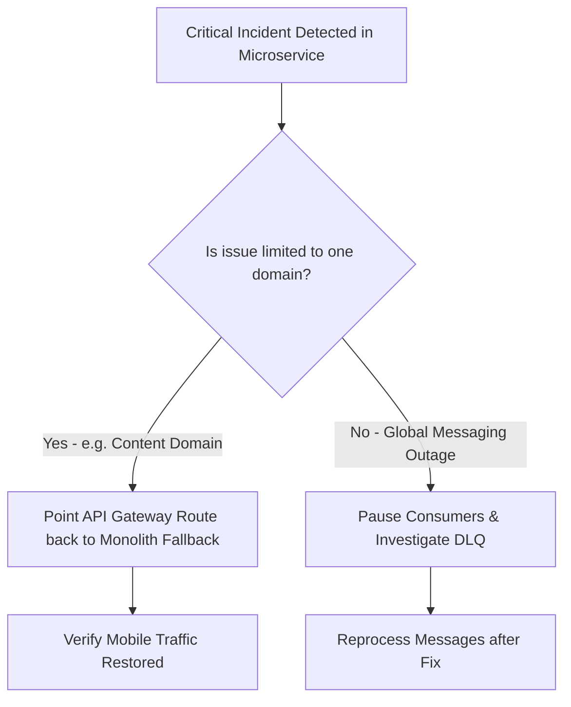

# 18 - Rollback & Disaster Recovery Plan

## Strangler Fig Rollback Procedure

Because the migration utilizes the Strangler Fig pattern with the API Gateway as a traffic coordinator, rollback can occur at the individual route or service level without risking overall platform downtime.

## Rollback Steps
1. **Traffic Diversion**: Update Gateway reverse-proxy configuration in `api-gateway/src/proxy/routes.js` to route traffic back to the modular monolith fallback.
2. **Database Reconciliation**: Synchronize newly created records from the microservice database back to the monolith database using the bidirectional sync script if required.
3. **Consumer Pause**: Temporarily cancel RabbitMQ consumer channels using the management UI (`http://localhost:15672`) while debugging.
4. **Post-Incident Analysis**: Review structured logs in Loki and error traces in Grafana to resolve root causes before re-enabling microservice routes.
